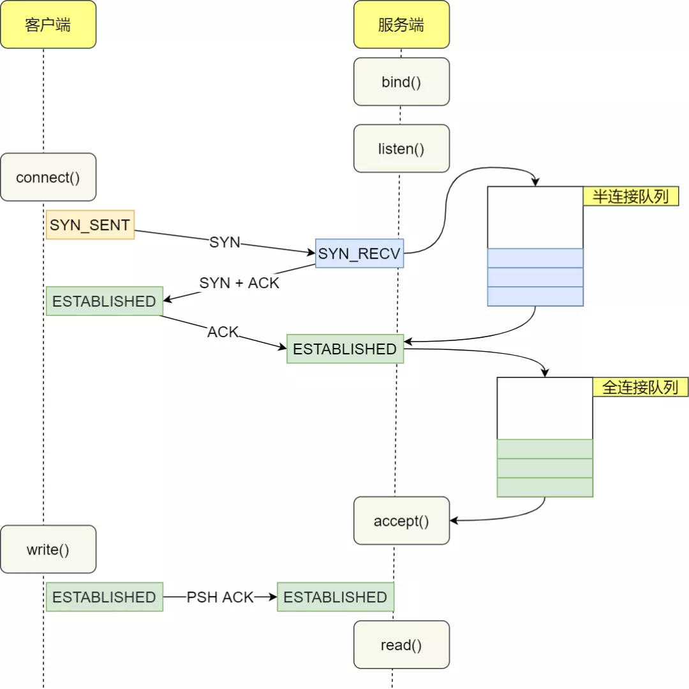

# 网络聊天室性能调优


## TCP三次握手调优

### 处理TCP 全连接队列溢出

**当服务端并发处理大量请求时，如果 TCP 全连接队列过小，就容易溢出。发生 TCP 全连接队溢出的时候，后续的请求就会被丢弃，这样就会出现服务端请求数量上不去的现象。**

```shell
# -l 显示正在监听(listening)的socket
# -n 不解析服务器的名称
# -t 只显示tcp的socket
ss -lnt | grep 8888
State       Recv-Q Send-Q           Local Address:Port       Peer Address:Port        
LISTEN      51     50               [::]:8888                     [::]:* 
```

- Recv-Q：当前全连接队列的大小，也就是当前已完成三次握手并等待服务端 `accept()` 的 TCP 连接个数
- Send-Q：当前全连接最大队列长度，上面的输出结果说明监听 8888 端口的 TCP 服务进程，最大全连接长度为 50

> 全连接队列满了，就只会丢弃连接吗？
>
> 丢弃连接只是 Linux 的默认行为，我们还可以选择向客户端发送 RST 复位报文，告诉客户端连接已经建立失败。
>
> `cat /proc/sys/net/ipv4/tcp_abort_on_overflow`
>
> tcp_abort_on_overflow 共有两个值分别是 0 和 1，其分别表示：
>
> - 0 ：表示如果全连接队列满了，那么 server 扔掉 client  发过来的 ack ；
> - 1 ：表示如果全连接队列满了，那么 server 发送一个 `reset` 包给 client，表示废掉这个握手过程和这个连接；

**如何增大 TCP 全连接队列？**

- TCP 全连接队列最大值取决于 somaxconn 和 backlog 之间的最小值，也就是 min(somaxconn, backlog)

- `somaxconn` 是 Linux 内核的参数，默认值是 128，可以通过 `/proc/sys/net/core/somaxconn` 来设置其值
- `backlog` 是 `listen(int sockfd, int backlog)` 函数中的 backlog 大小，ServerSocket中的默认值是50

`netstat -s | grep over overflowed`，服务端查看全连接队列是否有溢出；**如果持续不断地有连接因为 TCP 全连接队列溢出被丢弃，就应该调大 backlog 以及 somaxconn 参数**。

### 处理TCP 半连接队列溢出

**如何查看 TCP 半连接队列长度？**

```shell
netstat -natp | grep SYN_RECV | wc -l
```

**如果 SYN 半连接队列已满，只能丢弃连接吗？**

- **开启 syncookies 功能就可以在不使用 SYN 半连接队列的情况下成功建立连接**，在前面我们源码分析也可以看到这点，当开启了  syncookies 功能就不会丢弃连接
- syncookies 是这么做的：服务器根据当前状态计算出一个值，放在己方发出的 SYN+ACK 报文中发出，当客户端返回 ACK 报文时，取出该值验证，如果合法，就认为连接建立成功

**调优**

- 增大半连接队列
- 开启 tcp_syncookies 功能
- 减少 SYN+ACK 重传次数

## TCP 四次挥手的性能提升

### 主动方的优化

#### FIN_WAIT1 状态的优化

主动方发送 FIN 报文后，连接就处于 FIN_WAIT1 状态，正常情况下，如果能及时收到被动方的 ACK，则会很快变为 FIN_WAIT2 状态；但是当迟迟收不到对方返回的 ACK 时，连接就会一直处于 FIN_WAIT1 状态。此时，**内核会定时重发 FIN 报文，其中重发次数由 tcp_orphan_retries 参数控制**。

#### FIN_WAIT2 状态的优化

**如果连接是用 shutdown 函数关闭的，连接可以一直处于 FIN_WAIT2 状态，因为它可能还可以发送或接收数据。但对于 close 函数关闭的孤儿连接，由于无法在发送和接收数据，所以这个状态不可以持续太久，而 tcp_fin_timeout 控制了这个状态下连接的持续时长**，默认值是 60 秒。

#### TIME_WAIT 状态的优化

**Linux 提供了 tcp_max_tw_buckets 参数，当 TIME_WAIT 的连接数量超过该参数时，新关闭的连接就不再经历 TIME_WAIT 而直接关闭**

## 服务端使用线程池

之所以使用多线程，主要原因在于**socket.accept()、socket.read()、socket.write()三个主要函数都是同步阻塞的**，当一个连接在处理I/O的时候，系统是阻塞的，如果是单线程的话必然就挂死在那里；但CPU是被释放出来的，开启多线程，就可以让CPU去处理更多的事情。现在的多线程一般都使用线程池，可以让线程的创建和回收成本相对较低。在活动连接数不是特别高（小于单机1000）的情况下，这种模型是比较不错的，可以让每一个连接专注于自己的I/O并且编程模型简单，也不用过多考虑系统的过载、限流等问题。线程池本身就是一个天然的漏斗，可以缓冲一些系统处理不了的连接或请求。

```java
// 线程池的参数设置
private static final int CPU_CORE_SIZE = Runtime.getRuntime().availableProcessors();
private static final int CORE_POOL_SIZE = CPU_CORE_SIZE * 2;
private static final int MAX_POOL_SIZE = CPU_CORE_SIZE * 4;
private static final int BLOCK_QUEUE_SIZE = 1000;
ThreadPoolExecutor threadPoolExecutor = new ThreadPoolExecutor(CORE_POOL_SIZE,
                        MAX_POOL_SIZE,
                        60,
                        TimeUnit.SECONDS,
                        new ArrayBlockingQueue<Runnable>(BLOCK_QUEUE_SIZE));
```

## 基于多路复用的 NIO

### NIO模型

### select/poll/epoll


